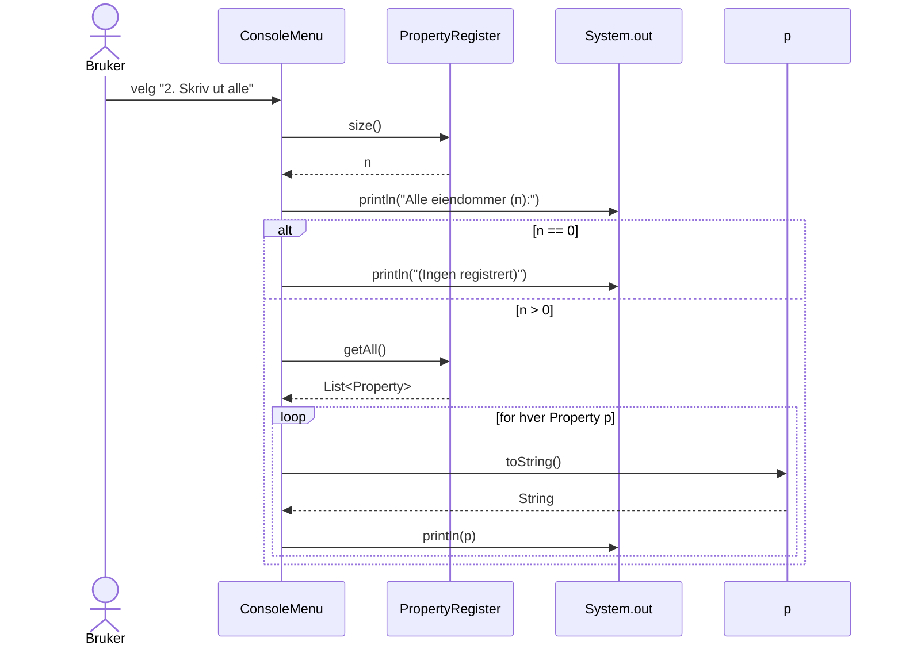

# Besvarelse – Eiendomsregister (Gloppen)

Dato: 2025-11-11

Denne filen samler svar og dokumentasjon for oppgavene 1–5, med kodeutdrag fra prosjektet slik det er implementert.

## Oppgave 1 – Modellering (klassediagram og begrunnelse)

Tekstlig UML som viser samarbeid mellom klassene i løsningen:

```
+--------------------+        uses         +-----------------------+
| RealEstateApp      |-------------------->| ConsoleMenu           |
|--------------------|                     |-----------------------|
| -register: PropertyRegister              | -register: PropertyRegister |
|--------------------|                     | -scanner: Scanner          |
| +main(args)        |                     |-----------------------|
| +seedTestData()    |                     | +start()                  |
+--------------------+                     | -show(): int              |
                                           | -addProperty()            |
                                           | -listAll()                |
                                           | -search()                 |
                                           | -averageArea()            |
                                           +---------------------------+
                                                    |
                                                    | calls
                                                    v
                                           +-----------------------+
                                           | PropertyRegister      |
                                           |-----------------------|
                                           | -properties: List<Property> |
                                           |-----------------------|
                                           | +addProperty(p): boolean    |
                                           | +deleteProperty(knr,gnr,bnr): boolean |
                                           | +getAll(): List<Property>   |
                                           | +find(knr,gnr,bnr): Optional<Property> |
                                           | +findByLotNumber(gnr): List<Property>   |
                                           | +averageArea(): double      |
                                           | +size(): int                |
                                           +-----------------------+
                                                       *
                                                       |
                                                       v
                                           +-----------------------+
                                           | Property              |
                                           |-----------------------|
                                           | +idString(): String   |
                                           | +getXxx()/setXxx()    |
                                           | +toString()           |
                                           | +equals()/hashCode()  |
                                           +-----------------------+
```

Begrunnelse:
- Separasjon av ansvar: UI (ConsoleMenu) håndterer all brukerinteraksjon; PropertyRegister kapsler samling, søk og analyser; Property er domenemodellen med validering og identitet.
- Lav kobling: ConsoleMenu snakker kun med PropertyRegister sitt offentlige API. Property er uavhengig av UI/I/O.
- Høy kohesjon: Hver klasse har et tydelig ansvar. Identitet er samlet i Property (equals/hashCode/idString). Aggregatfunksjoner som averageArea ligger i registeret.

## Oppgave 2a – Klasse for eiendom (navn, felt, konstruktør, aksessorer, mutatorer, dokumentasjon)

Valg: Klassen heter `Property`. Identitet defineres av (kommunenr, gnr, bnr). Disse feltene er immutable. Mutatorer finnes for bruksnavn, areal og eiernavn (ting som kan endre seg naturlig). Begrunnelsen ligger i Javadoc under.

Utdrag fra `src/no/gloppen/eiendom/Property.java`:

```java
/**
 * Representerer en eiendom i Norge.
 *
 * <p>Identifiseres unikt ved kombinasjonen kommunenummer, gnr (gårdsnummer)
 * og bnr (bruksnummer). Bruksnavn er valgfritt.</p>
 */
public class Property {
    // Immutable identitet
    private final int municipalityNumber;   // [101, 5054]
    private final String municipalityName;  // ikke-null/ikke-tom
    private final int lotNumber;            // gnr > 0
    private final int sectionNumber;        // bnr > 0

    // Mutable egenskaper
    private String name;              // kan være tom
    private double areaSqm;           // > 0
    private String ownerName;         // ikke-null/ikke-tom

    public Property(int municipalityNumber,
                    String municipalityName,
                    int lotNumber,
                    int sectionNumber,
                    String name,
                    double areaSqm,
                    String ownerName) { /* validering og init */ }

    // Aksessorer
    public int getMunicipalityNumber() { return municipalityNumber; }
    public String getMunicipalityName() { return municipalityName; }
    public int getLotNumber() { return lotNumber; }
    public int getSectionNumber() { return sectionNumber; }
    public String getName() { return name; }
    public double getAreaSqm() { return areaSqm; }
    public String getOwnerName() { return ownerName; }

    // Mutatorer (kun felter som kan endres naturlig)
    public void setName(String name) { this.name = name == null ? "" : name.trim(); }
    public void setAreaSqm(double areaSqm) { /* >0 validering */ this.areaSqm = areaSqm; }
    public void setOwnerName(String ownerName) { /* ikke tom */ this.ownerName = ownerName.trim(); }

    public String idString() { return municipalityNumber + "-" + lotNumber + "/" + sectionNumber; }

    @Override public String toString() { /* formatert utskrift */ }
    @Override public boolean equals(Object o) { /* identitet */ }
    @Override public int hashCode() { /* identitet */ }
}
```

Begrunnelse for mutatorer: Bruksnavn kan legges til/endres; areal kan revideres ved ny oppmåling; eier skifter ved salg. Identitetsfeltene endres ikke, da de definerer eiendommen juridisk og brukes i equals/hashCode.

## Oppgave 2b – Metode som returnerer «kommunenr-gnr/bnr»

Implementert i `Property.idString()`:

```java
public String idString() {
    return municipalityNumber + "-" + lotNumber + "/" + sectionNumber;
}
```

Eksempel: 1445, gnr 54, bnr 73 -> "1445-54/73".

## Oppgave 3a – Klasse for eiendomsregisteret, datastruktur og metoder

Valg av datastruktur: `ArrayList<Property>` fordi antall eiendommer ikke er kjent på forhånd (dynamisk), Ø(1) amortisert innsetting, enkel iterasjon for utskrift. Lineært søk/sletting Ø(n) er tilstrekkelig for oppgaven. Identitet/unikhet sikres via `Property.equals/hashCode` (kommunenr, gnr, bnr). For større skala kunne en `HashMap<String, Property>` med nøkkel `kommunenr-gnr/bnr` gitt Ø(1) oppslag.

Utdrag fra `src/no/gloppen/eiendom/PropertyRegister.java`:

```java
public class PropertyRegister {
    private final List<Property> properties = new ArrayList<>();

    public boolean addProperty(Property property) { /* unikhet + add */ }

    public List<Property> getAll() { return Collections.unmodifiableList(properties); }

    public boolean deleteProperty(int municipalityNumber, int lotNumber, int sectionNumber) {
        /* finn og fjern, returner true hvis slettet */
    }

    public Optional<Property> find(int municipalityNumber, int lotNumber, int sectionNumber) {
        /* lineært søk */
    }

    public int size() { return properties.size(); }
}
```

## Oppgave 3b – Gjennomsnittsareal

Implementert som `averageArea()` i `PropertyRegister`:

```java
public double averageArea() {
    if (properties.isEmpty()) return 0.0;
    double sum = 0.0;
    for (Property p : properties) {
        sum += p.getAreaSqm();
    }
    return sum / properties.size();
}
```

## Oppgave 3c – Finn alle eiendommer med gitt gårdsnummer (gnr)

Implementert som `findByLotNumber(int lotNumber)` i `PropertyRegister`:

```java
public List<Property> findByLotNumber(int lotNumber) {
    if (lotNumber <= 0) {
        throw new IllegalArgumentException("Gårdsnummer (gnr) må være > 0.");
    }
    List<Property> result = new ArrayList<>();
    for (Property p : properties) {
        if (p.getLotNumber() == lotNumber) {
            result.add(p);
        }
    }
    return result;
}
```

## Oppgave 4a – Tekstbasert brukergrensesnitt (klientprogram)

Klassen `ConsoleMenu` har ansvar for meny, inputvalidering og utskrift. Den bruker `PropertyRegister` for all forretningslogikk.

Utdrag fra `src/no/gloppen/eiendom/ConsoleMenu.java`:

```java
public class ConsoleMenu {
    private static final int ADD_PROPERTY = 1;
    private static final int LIST_ALL_PROPERTIES = 2;
    private static final int FIND_PROPERTY = 3;
    private static final int CALCULATE_AVERAGE_AREA = 4;
    private static final int EXIT = 9;

    private final PropertyRegister register;
    private final Scanner scanner = new Scanner(System.in).useLocale(Locale.US);

    public void start() {
        boolean finished = false;
        while (!finished) {
            int choice = show();
            switch (choice) {
                case ADD_PROPERTY -> addProperty();
                case LIST_ALL_PROPERTIES -> listAll();
                case FIND_PROPERTY -> search();
                case CALCULATE_AVERAGE_AREA -> averageArea();
                case EXIT -> finished = true;
                default -> System.out.println("Ukjent valg.\n");
            }
        }
    }

    private int show() { /* viser meny og validerer heltall */ }
    private void listAll() { /* skriver ut alle, eller '(Ingen registrert)' */ }
}
```

Oppstart (`src/no/gloppen/eiendom/RealEstateApp.java`):

```java
public static void main(String[] args) {
    RealEstateApp app = new RealEstateApp();
    app.seedTestData();
    new ConsoleMenu(app.register).start();
}
```

## Oppgave 4b – Sekvensdiagram for «Skriv ut alle eiendommer i registeret»

ASCII-sekvens:

```
Bruker          ConsoleMenu                PropertyRegister               System.out
  |                  |                             |                            |
  |  velger "2"      |                             |                            |
  |----------------->| listAll()                   |                            |
  |                  |                             |-- size() ----------------> |
  |                  |                             |<--------- int ------------ |
  |                  |  println("Alle eiendommer (n):")                         |
  |                  |                             |                            |
  |                  |                             |-- getAll() --------------> |
  |                  |                             |<----- List<Property> ----- |
  |                  |  if n == 0: println("(Ingen registrert)")               |
  |                  |  else:                                                     |
  |                  |    loop over Property p:                                   |
  |                  |      p.toString(); println(p)                              |
  |                  |                                                            |
```

Mermaid-diagram:



## Oppgave 5 – Vurdering av design (kobling og samstemthet)

Coupling (kobling):
- Løs kobling mellom oppstart og UI: `RealEstateApp` kjenner kun til `PropertyRegister` og starter `ConsoleMenu`. Ingen sirkelavhengigheter.
- UI er koblet til domenet via offentlige metoder: `addProperty`, `find`, `findByLotNumber`, `getAll`, `averageArea`, `size`. Ingen direkte tilgang til intern liste; `getAll()` gir en umodifiserbar visning.
- Domenemodellen `Property` er ren og avhengighetsfri (ingen I/O/UI-avhengigheter). Bruk av `Optional` i `find` skjuler fravær uten null-lekkasje.
- Bruk av Optional i `no.gloppen.eiendom.PropertyRegister.find` skjuler fravær uten å lekke interne null-kontrakter.
- Potensiell videre forbedring: Et interface (f.eks. PropertyRepository) kunne redusert kobling mellom UI og konkret registerimplementasjon ytterligere.

Cohesion (samstemthet):
- `Property` har høy kohesjon: data + validering + identitet (`equals/hashCode`) + `idString`.
- `PropertyRegister` samler all samlingslogikk: registrering/sletting/søk/aggregering. Metodene er små og fokuserte.
- `ConsoleMenu` har kun ansvar for brukerinteraksjon (meny, input, utskrift). Oppdelte metoder som `addProperty`, `listAll`, `search`, `averageArea`.
- Oppstart/seed ansvar isolert i `no.gloppen.eiendom.RealEstateApp.seedTestData`; klassen gjør ikke annen forretningslogikk.

Forbedringsmuligheter: Et `PropertyRepository`-interface kunne ytterligere redusert kobling mellom UI og konkret lagring, og gjort det enklere å bytte til fil/DB senere.

---

Denne besvarelsen gjenspeiler koden slik den ligger i prosjektet per datoen over, med relevante kodeutdrag og begrunnelser for designvalg.
