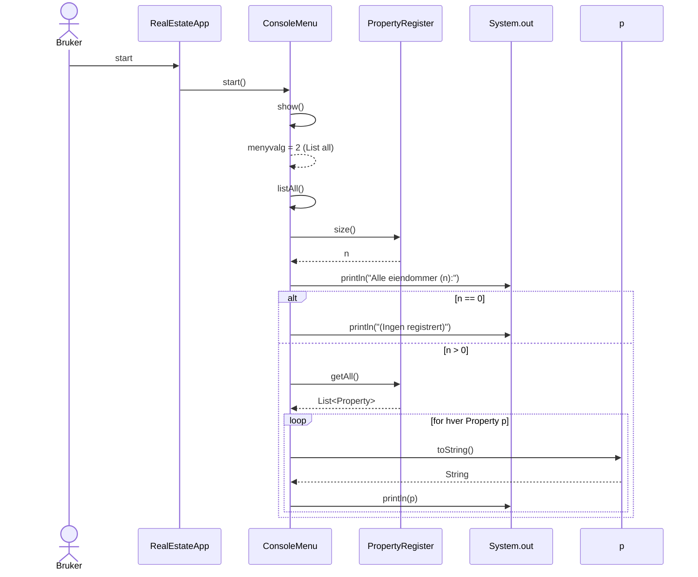

# Sekvensdiagram – "Skriv ut alle eiendommer i registeret"

Følger flyten i dagens implementasjon: [`no.gloppen.eiendom.RealEstateApp.main`](src/no/gloppen/eiendom/RealEstateApp.java) →
[`no.gloppen.eiendom.ConsoleMenu.start`](src/no/gloppen/eiendom/ConsoleMenu.java) →
[`no.gloppen.eiendom.ConsoleMenu.show`](src/no/gloppen/eiendom/ConsoleMenu.java) →
[`no.gloppen.eiendom.ConsoleMenu.listAll`](src/no/gloppen/eiendom/ConsoleMenu.java) →
[`no.gloppen.eiendom.PropertyRegister.size`](src/no/gloppen/eiendom/PropertyRegister.java) /
[`no.gloppen.eiendom.PropertyRegister.getAll`](src/no/gloppen/eiendom/PropertyRegister.java) →
[`no.gloppen.eiendom.Property.toString`](src/no/gloppen/eiendom/Property.java).

ASCII-sekvens

Bruker          ConsoleMenu                PropertyRegister               System.out
  |                  |                             |                            |
  |  starter app     |                             |                            |
  |----------------->| start()                     |                            |
  |                  |---- show() ---------------->|                            |
  |                  |<--- valg "2" -------------- |                            |
  |                  |---- listAll() ------------- |                            |
  |                  |                             |-- size() ----------------> |
  |                  |                             |<--------- int ------------ |
  |                  |  println("Alle eiendommer (n):")                         |
  |                  |                             |                            |
  |                  |                             |-- getAll() --------------> |
  |                  |                             |<----- List<Property> ----- |
  |                  |  if n == 0: println("(Ingen registrert)")               |
  |                  |  else:                                                     |
  |                  |    loop over hver Property p:                              |
  |                  |      p.toString()                                          |
  |                  |      println(p)                                            |
  |                  |                                                          |
  |                  | return til hovedløkke                                    |
  |                  |                                                          |

Mermaid (kan limes inn i verktøy som støtter Mermaid)

