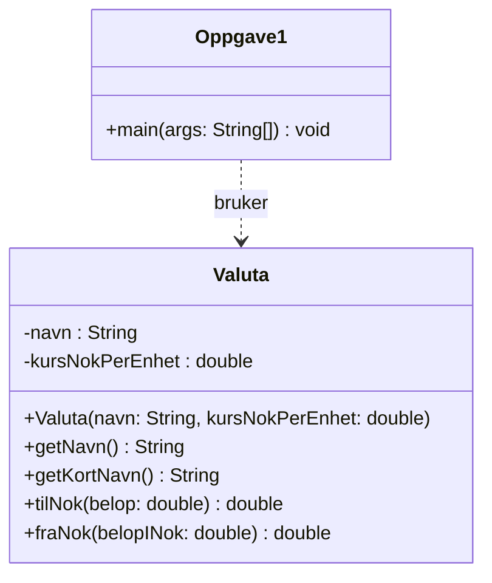
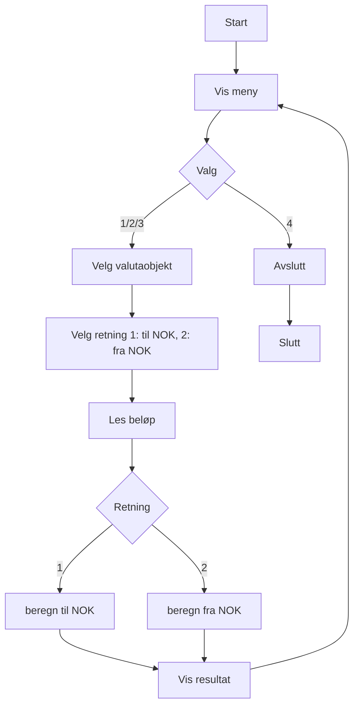
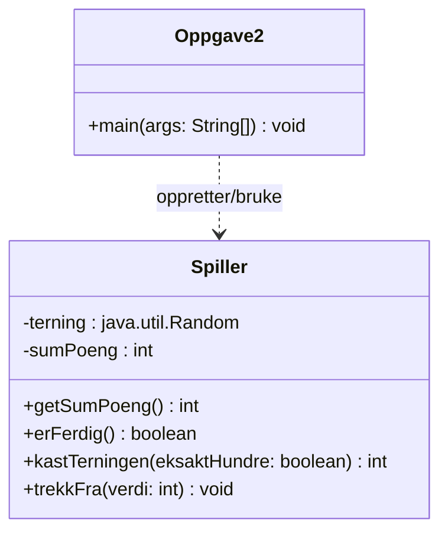

# Øving 4 – OOP, Klasser

## Oppgave 1 – Valuta
- Klasse: `Valuta` med konstruktør, `tilNok()` og `fraNok()`.
- Klient: `Oppgave1` med meny for å omregne beløp.

### Klassediagram

### Aktivitetsdiagram (klientprogrammet `Oppgave1`)

## Oppgave 2 – Terningspillet 100
- Klasse: `Spiller` med `sumPoeng`, `getSumPoeng()`, `kastTerningen()`, `erFerdig()`.
- Klient: `Oppgave2` simulerer runder til en spiller vinner. Enkel variant som standard; sett `eksaktHundre=true` i `Oppgave2` for raffinert regel.

### Klassediagram

## Kjøring
- Kjør `Oppgave1` for valutaomregning.
- Kjør `Oppgave2` for terningspillet.
